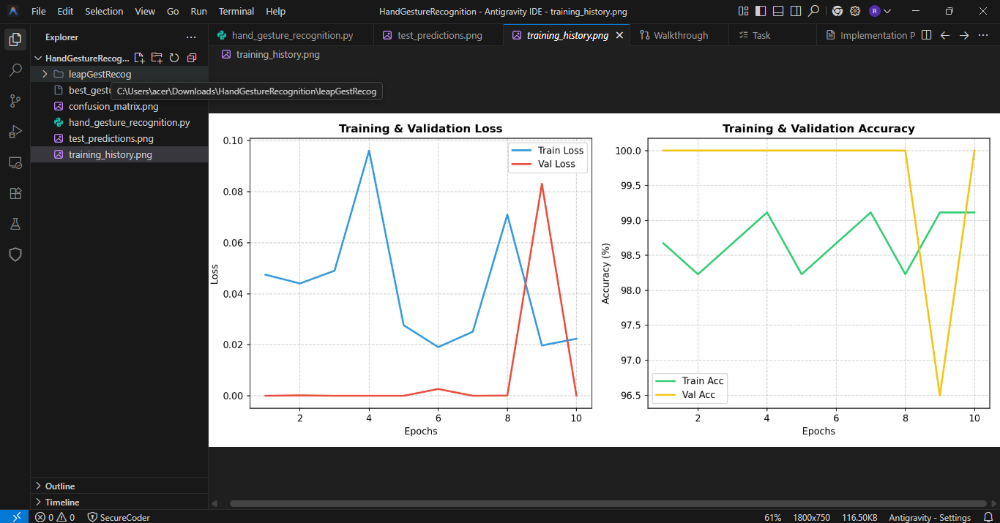
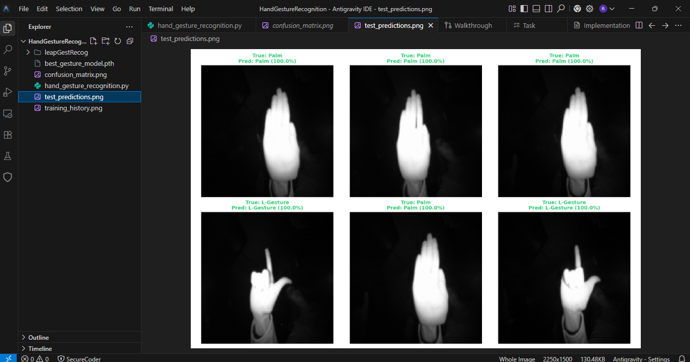
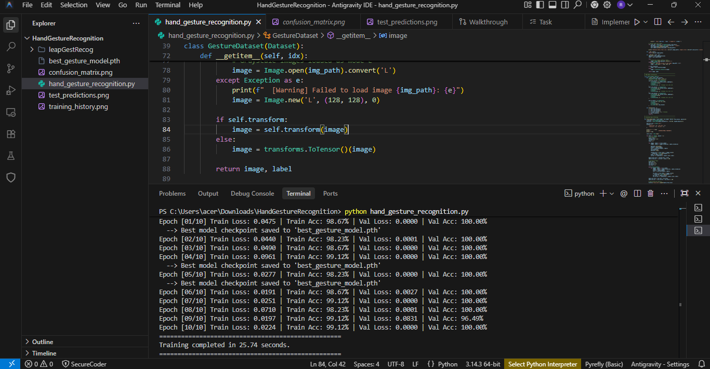
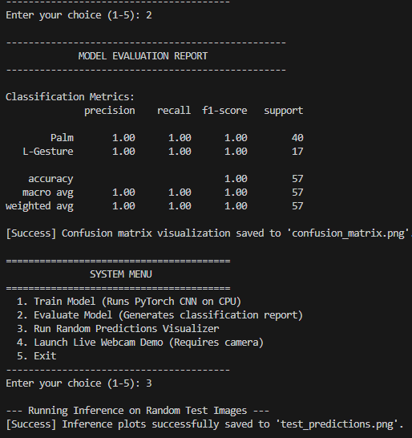
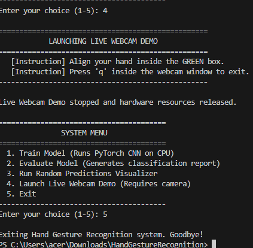

# PRODIGY_ML_04
Task 4-Hand Gesture Recognition using Deep Learning and Computer Vision to classify different hand gestures from image data for intuitive human-computer interaction.

# Output Screenshots

## Training Predictions

## Test Predictions

## Output 1

## Output 2

## Output 3

# Demo Video

Project demonstration video:

[▶️ Watch Demo Video](./Live%20Gesture%20Recognition%202026-05-30%2016-51-54.mp4)
